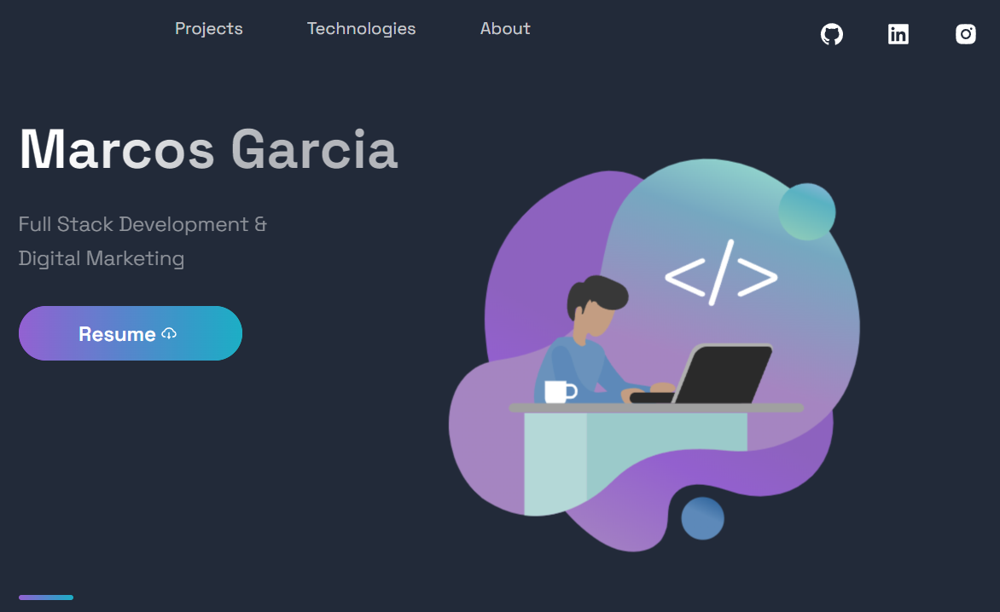

<h4 align="center">
 
 <b>Marcos' Portfolio</b> 🦸‍♂️
</h4>

  

 

### :rocket: Used Technologies

The following project was made

- [Next.js](https://nextjs.org/)
- [Styled-components](https://styled-components.com/)

### :muscle: Project

This <b>Portfolio</b> is a project to resemble my front end skills but I encourage you to access it and see more about my other projects.

### 🙋🏽‍♂️ Author's considerations

The project was a great challenge filled with the most current technologies in Webdesign. For being a whole full stack project, despite the mobile section, the concepts of backend and frontend integration, REST API, Database connection, among others had to be introduced. Thankfully the classes [COMP 2912 - Node.js](https://www.bcit.ca/study/courses/comp2912) and [COMP 1630 - Relational Database Design and SQL](https://www.bcit.ca/study/courses/comp1630) were permeated with knowledge and useful thoughts from experienced professionals.

The use of React.js was also reasonably crucial due to its demand nowadays, and the number of tools that can be used with it.
After finishing [COMP 2913 - React and Modern JavaScript](https://www.bcit.ca/study/courses/comp2913) at BCIT I was convinced that the future of frontend was in react, thanks to the user that can be given it and the ease of use, but at the same time, it felt a lot like an introduction and awakened a stronger hunger to keep learning and developing other projects.

It was great to use some useful tools for the first time like <b>Knex</b>, that offers such easy way to create database tables and connections using SQLite3, <b>Expo</b>, that greatly foments mobile development and testing, and <b>Insomnia</b>, that is a lot like Postman but proved to be as useful but feels more modern and smoother.

The project is quite simple but an amazing journey through the market's most powerful stack that is fondly referred to as Omnistack by Rocket Seat and its team.

---

- Fork this repository;
- Create a branch with your feature: `git checkout -b my-feature`
- Commit your changes: `git commit -m 'feat: My new feature'`
- Push your branch: `git push origin my-feature`

### :memo: License

This project is under the MIT License. See the file [LICENSE](LICENSE.md) for more details.

---

Made with love ❤️ by <b><a src="https://github.com/yamgarcia">Marcos Garcia</a></b>

